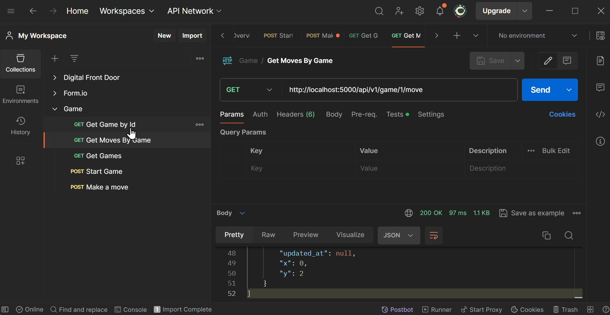

# Ethyca Game Challengue

## Requirements
- Python 3.10

## Instructions for Mac/Linux (Dev)
```
pip install -r requirements.txt
cd app
export FLASK_APP=application.py
export FLASK_DEBUG=1
export FLASK_ENV=development
flask run --host=0.0.0.0
```

# Postman
Please import the postman.json file into your Postman application and then execute the endpoints like this:
  


# Time Allocation
- Creating the initial Flask project: 0.5 hours
- Developing models: 0.5 hours
- Adding Alembic for migration generation: 0.5 hours
- Implementing routes and schemas: 1 hour
- Building services: 1 hour
- Testing with Postman collection: 0.5 hours
- Code refactor and formatting with Black and Isort: 0.5 hours
- Bug fixes and README.md enhancements: 0.5 hours (completed post-submission)


# Outstanding Tasks
- Unit testing
- JWT authentication
- Swagger documentation
- Improved exception handling
- Dockerfile and docker-compose setup
- Pre-commit hooks for formatting and linting
- Deployment on AWS or GCP
- Enhanced README documentation
- Integration with another database (e.g., PostgreSQL or MySQL)

Completing these tasks could take at least one additional day.

Assumptions
This project is a simple REST API for playing tic-tac-toe, the assumptions are:
- The user cannot repeat a move.
- Moves cannot be made after determining a winner.
- User cannot perform a move made by the machine.
- The machine's moves are random, not strategic.
- Moves outside the 3x3 grid are not allowed.

# Trade-offs
- SQLite was chosen as the database for simplicity.
- JWT authentication was omitted to save time.
- Unit testing was skipped to adhere to the 4-hour challenge timeframe.
- Swagger documentation was not added due to time constraints, although it would enhance API usability.


# Special/Unique features
While the project may not have unique features, the inclusion of Alembic and a model layer with SQLAlchemy is noteworthy.

# Feedback
This was an enjoyable challenge.